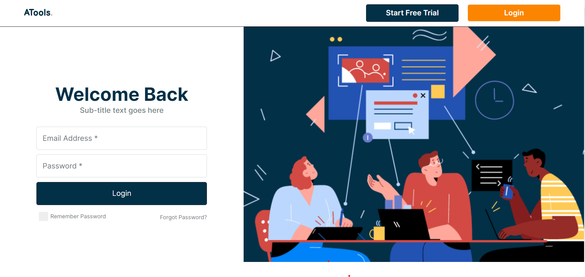
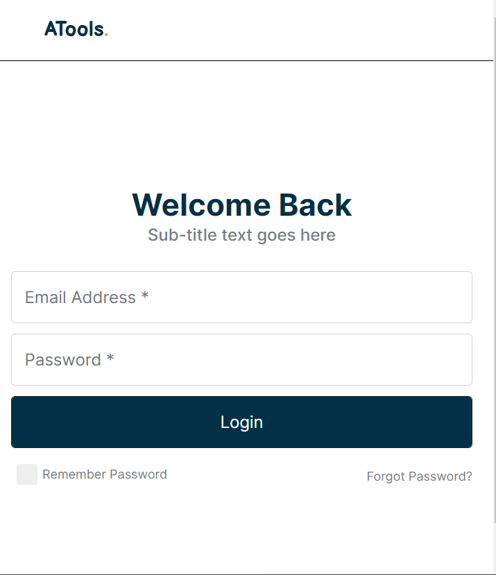

DESKTOP VIEW :

  </img>
  

MOBILE VIEW :  

</img>
  

<h1>Built With</h1>

This project was built using these technologies.

- React.js
- Node.js
- CSS3
- Ant Design
- VsCode
- Netlify

<h2>Features</h2>

🎨 Styled with Ant Design and CSS with easy to customize colors

📱 Fully Responsive Login page (Desktop View + Mobile View).

<h2>Getting Started</h2>
Clone down this repository. You will need node.js and git installed globally on your machine.

<h2>🛠 Installation and Setup Instructions</h2>
Installation: npm install

In the project directory, you can run: npm start

Runs the app in the development mode.
Open http://localhost:3000 to view it in the browser. The page will reload if you make edits.

Usage Instructions
Open the project folder and Navigate to /src/components/.
You will find all the components used and you can edit your information accordingly.
